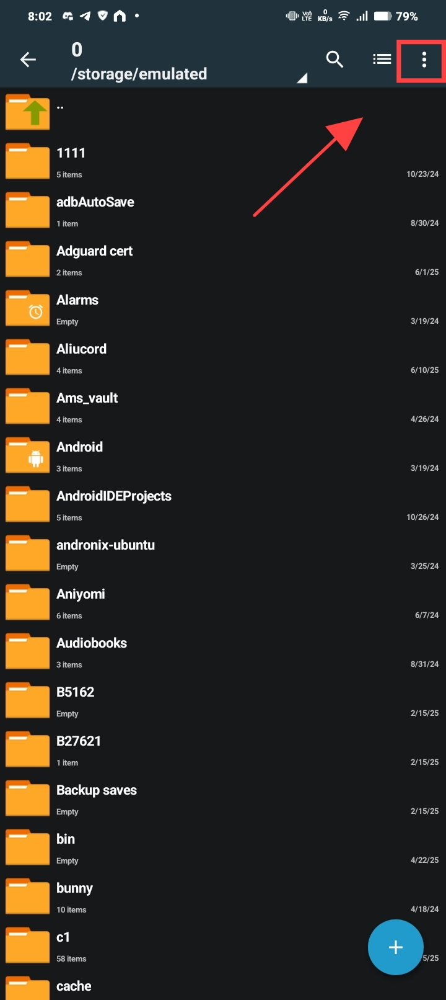
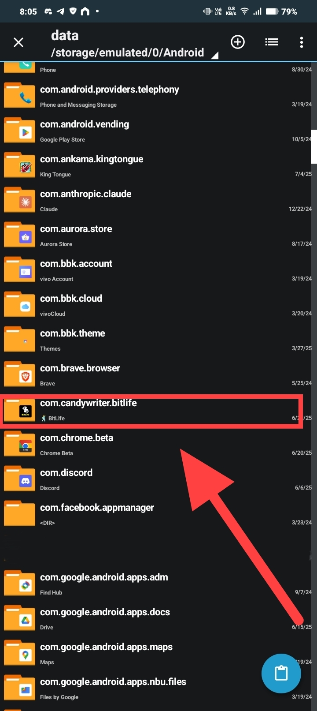

# Welcome to BitGuides!

Made by [u/C1oudyLol](https://www.reddit.com/u/C1oudyLol/)

<!-- prettier-ignore-start -->
!!! warning "MonetizationVars File Update Required"
    The MonetizationVars file is outdated and won't be updated for a while. To get the latest version, head over to [u/BitLifeRebels](https://www.reddit.com/r/BitLifeRebels/) and search for "MonetizationVars".
<!-- prettier-ignore-end -->

<!-- prettier-ignore-start -->
!!! info "Works on Android 15+ and future Modern Versions"
    This method works perfectly on future modern Android versions, including the latest **Android 15+**. It uses Shizuku, which is currently the **most stable and reliable method** for accessing the `Android/data` folder without rooting your device.
<!-- prettier-ignore-end -->

---

## Requirements

You need four things to get started. The main download link for the
MonetizationVars file is always updated here, but you can also find it in the
community Reddit post.

- **Shizuku**:
  [Download from Google Play](https://play.google.com/store/apps/details?id=moe.shizuku.privileged.api)

<!-- prettier-ignore-start -->
!!! info "Can't Download Shizuku from Play Store?"
    If the Play Store says "This app isn't available for your device" or mentions the app was made for an older version of Android, download Shizuku directly from GitHub instead: [Shizuku GitHub Releases](https://github.com/RikkaApps/Shizuku/releases)
<!-- prettier-ignore-end -->

- **ZArchiver**:
  [Download from Google Play](https://play.google.com/store/apps/details?id=ru.zdevs.zarchiver)
- **BitLife**:
  [Download from Google Play](https://play.google.com/store/apps/details?id=com.candywriter.bitlife)
- **MonetizationVars File**: **[Download Latest Version](l_monetizationvars)**

---

## Setup & Installation

### Step 1: Activate Shizuku

You must start Shizuku using the **Wireless Debugging** method. This is the most
important step.

- Go to the official guide and follow the section **"Start via Wireless
  Debugging":**
  **[https://shizuku.rikka.app/guide/setup/](https://shizuku.rikka.app/guide/setup/)**

### Step 2: Configure ZArchiver

1. Open ZArchiver.
2. Click the three dots on the top right.
   
3. Click **Settings**.
   
4. Click **ROOT**.
   
5. Click **Root Access** and select **Shizuku** from the dropdown menu.

<!-- prettier-ignore-start -->
!!! warning "Shizuku Must Be Running"
    Shizuku must be running already for this to work.

    
<!-- prettier-ignore-end -->

6. Enable the option **Use for Android/[data|obb]**.
   

<!-- prettier-ignore-start -->
!!! warning "IMPORTANT: ZArchiver Permission Settings"
    **ONLY** enable **"Use for Android/[data|obb]"** option.

    **DO NOT ENABLE "File operations"**

    Only the Android/data access is needed for this guide to work properly.
<!-- prettier-ignore-end -->

### Step 3: Apply new MonetizationVars

1. Navigate to your **Download** folder.

<!-- prettier-ignore-start -->
!!! note "File Naming Requirements"
    The file must be named **exactly** `MonetizationVars` with no extra
    extension.
<!-- prettier-ignore-end -->

2. Long-press the `MonetizationVars` file and click **Copy**.
   
3. Go to the ZArchiver home screen and navigate to the **Android** folder.
   
4. A Shizuku pop-up will appear. Click **Allow all the time**.
   
5. Navigate to the **data** folder.
   
6. Open the **com.candywriter.bitlife** folder.
   
7. Navigate to the **files** folder.
   
8. Click the **paste icon** on the bottom right.
   
9. When asked to "Overwrite File?," check the box and click **REPLACE**.
   

### Step 4: Make the Mod Permanent

1. In the same folder (`.../files/`), find the file named `LiveDictionary`.
2. **Delete** the `LiveDictionary` file.
   
3. Create a new **folder** (not a file) and name it exactly `LiveDictionary`.
   

---

## Advanced Customization with BitEdit

<!-- prettier-ignore-start -->
!!! tip "For Power Users: Create a MonetizationVars Mod"
    If you want more control and wish to enable or disable specific things yourself on MonetizationVars, you can use my other project, **BitEdit**.

    BitEdit is a web tool that lets you edit the `MonetizationVars` file using a simple, human-readable interface. You don't need to understand complex JSON code.

    **How it works:**
    1.  Go to the BitEdit web tool: **[Click here to open BitEdit](https://s0methingsomething.github.io/BitEdit/)**
    2.  Make your desired changes to MonetizationVars.
    3.  Download your new, `MonetizationVars` file from the tool.
    4.  Follow **Step 3** and **Step 4** of this guide using your newly created file.
<!-- prettier-ignore-end -->

---

## Final Notes & Community

- **Community Support on r/BitLifeRebels**

<!-- prettier-ignore-start -->
!!! quote "Get Help and Updates"
    For questions and help, a great place to go is the `r/BitLifeRebels`
    subreddit. My bot, **BitBot**, automatically posts the newest
    `MonetizationVars` file there as soon as it's released.
    **[Go to the Latest BitBot Post](lreddit_post)**
<!-- prettier-ignore-end -->

- **The mod is PERMANENT.** You only need to do this once.

- **Shizuku isn't permanent.**

<!-- prettier-ignore-start -->
!!! warning "Restart Shizuku After Reboot"
    You must restart Shizuku using Wireless Debugging every time
    you reboot your phone. You only need to do this if you plan on browsing
    `Android/data`, not for the mod to work.
<!-- prettier-ignore-end -->

<!-- prettier-ignore-start -->
!!! info "When BitLife Updates with New IAP"
    When BitLife releases a new update with new In-App Purchases (IAP), you'll need to get the latest MonetizationVars file and replace it again.

    **You DON'T need to:**
    - Set up ZArchiver again
    - Configure Shizuku permissions again

    **You ONLY need to:**
    - Activate Shizuku
    - Download the latest MonetizationVars file
    - Follow **Step 3** (Apply new MonetizationVars) to replace the old file

    The setup is permanent - only the MonetizationVars file needs updating when BitLife adds new content.
<!-- prettier-ignore-end -->

Once finished, force close BitLife and open it again. Everything will be
unlocked.